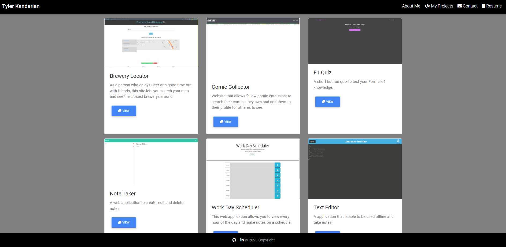

# React Portfolio

## Description

This React site was made to let me have a portfolio to show off work that I have done, Information about me, my resume and a contact form. This site is an ongoing project and new features will alwasy be implemented. As of now the contact form does not work but will get updated to handle real message requests.

## Table of Contents

- [Installation](#installation)
- [Usage](#usage)
- [License](#license)
- [Contributing](#contributing)
- [Tests](#tests)
- [Questions](#questions)

## Installation

N/A

## Usage

https://tylerkandarian.github.io/react-portfolio/#/about

## License

This project is license under MIT

## Contributing

At this time there is no need to contribute.

## Tests

N/A

## Questions

If you have any questions, please email me at Tyler.Kand2@gmail.com. You can also view more of my work at https://github.com/TylerKandarian.